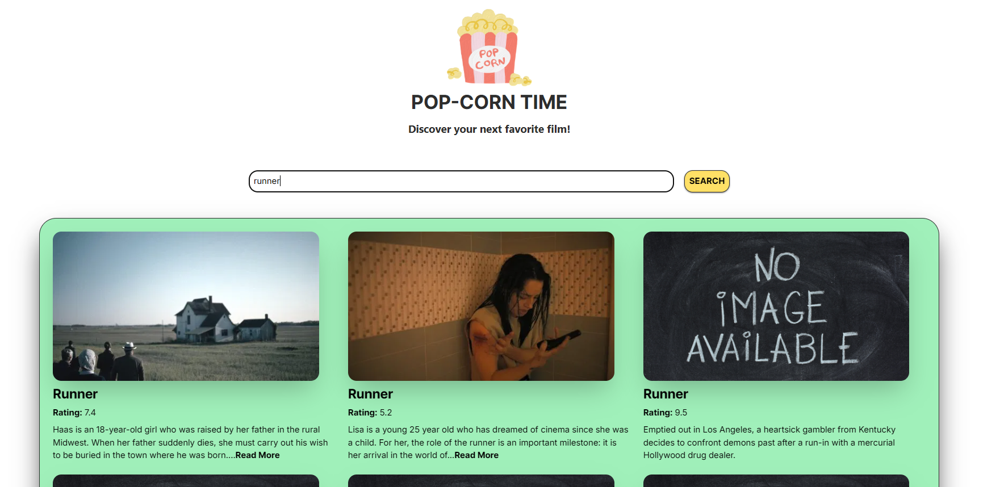

# react-movie-list

> A sleek and responsive Movie List application built using **React**, **TypeScript**, and **Tailwind CSS**.

## Table of contents

- [react-movie-list](#react-movie-list)
  - [Table of contents](#table-of-contents)
  - [General info](#general-info)
  - [Screenshots](#screenshots)
  - [Technologies](#technologies)
  - [Code Examples](#code-examples)
  - [Features](#features)
  - [To-do list](#to-do-list)
  - [Status](#status)
  - [Contact](#contact)

## General info

**React Movie List** is a fast and user-friendly app that allows users to search for movies by typing keywords.  
Built with **React**, **TypeScript**, and **Tailwind CSS**, it delivers a smooth and modern UI, responsive on both desktop and mobile.  

## Screenshots



## Technologies

- React
- TypeScript
- Tailwind CSS
- Node.js
- Visual Studio Code

## Code Examples

```tsx
  return (
    <p>
      {lessWords}
      {needToHideWords && (
        <>
          {!isExpanded && <span aria-hidden="true">...</span>}
          <span
            aria-hidden={isExpanded}
            aria-live="polite"
            className={isExpanded ? '' : 'hidden'}
          >
            {' '}
            {restOfWords}
          </span>
          <button
            className="font-bold cursor-pointer"
            aria-expanded={isExpanded}
            aria-controls={`more text - ${title}`}
            onClick={() => setIsExpanded(!isExpanded)}
          >
            {isExpanded ? '- Read Less' : 'Read More'}
          </button>
        </>
      )}
    </p>
  );
```

## Features

- Public movie API
- A11y
- Display a list of movie titles and descriptions
- Interactive search bar

## To-do list

- Add pagination or infinite scroll

## Status

Project is: done

## Contact

By [boba-milktea](https://github.com/boba-milktea)